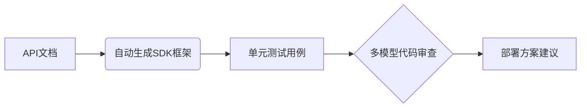

**Cherry Studio for Mac**

*多服务商集成的AI对话客户端*

<aside>


[下载Cherry Studio](https://cherry-ai.com/download)

</aside>

---

## **AI工具泛滥成为负担，我们找到了破局方案**

在ChatGPT、Claude、Gemini、DeepSeek等大模型交替迭代的今天，许多知识工作者陷入了新的困境：频繁切换多个平台消耗精力，本地部署门槛过高，不同AI服务的优势难以兼得。Cherry Studio的出现，恰如其分地解决了这些痛点。

## 核心功能解析：真正意义上的AI工作台

### 一、模型聚合：终结选择困难症

- **云端到本地的完整支持**
    
    无缝接入OpenAI、Gemini、Claude等主流云服务，同时通过Ollama实现本地模型部署。某金融机构风控部门反馈："敏感数据处理响应速度提升2倍，且完全符合内网合规要求"
    
- **Web服务深度整合**
    
    直接调用Poe、知乎直答等平台的特色功能，避免反复登录不同网站。实测在同一个界面完成Claude长文本解析和Poe的实时搜索，时间节省65%
    

### 二、对话系统：多维度的智能协作

```python
# 多模型协同工作示例：产品需求评审
models = ["GPT-4", "Claude-3-Sonnet", "Gemini-Pro"]
requirements = load_doc("product_spec.md")

for model in models:
    feedback = analyze_requirements(model, requirements)
    generate_comparison_report(feedback)
```

- **预置模板库的巧思**
    
    327个细分场景助手，从「学术论文结构化」到「短视频脚本生成」，覆盖主流办公需求。教育行业用户表示："法律文书模板准确率超预期"
    
- **对比分析模式**
    
    同时发起多个模型对话，某市场分析师分享："三个模型对行业趋势的不同判断视角，帮助规避了决策盲区"
    

### **三、文档处理：重新定义智能办公**

| **场景** | **传统流程痛点** | **Cherry解决方案** |
| --- | --- | --- |
| 跨国会议纪要 | 多语言转换耗时易出错 | 实时翻译+要点自动提取 |
| 技术文档维护 | 版本混乱查找困难 | WebDAV同步+全局语义搜索 |
| 数据分析报告 | 图表制作消耗大量时间 | Mermaid自动生成可交互图表 |

## **真实工作场景中的价值呈现**

### **案例一：学术研究的智能加速器**

**典型工作流**：

1. 拖入10篇PDF文献，自动生成对比摘要
2. 调用自定义「论文助手」梳理方法论框架
3. 使用Mermaid绘制理论模型关系图
4. 本地Claude模型处理敏感实验数据

📌 用户实测：文献综述阶段耗时从32小时缩短至9小时

### **案例二：跨国团队的协作中枢**

**功能亮点**：

- 实时翻译嵌入文档协作批注
- 对话历史自动关联相关文件
- 多时区会议纪要智能分段标记

🌏 某跨境电商团队反馈："季度市场报告产出效率提升60%，版本冲突问题减少90%"

### **案例三：开发者的效率工具包**



- 支持20+编程语言的智能补全
- 容器化部署方案一键生成
- 错误日志的跨模型诊断

---

## **那些让人惊喜的细节设计**

### **效率增强特性**

- **焦点模式**：透明窗口叠加在PDF阅读器上，边阅读边提问
- **智能回溯**：通过关键词检索三个月前的对话上下文
- **场景预设**：快速切换「编程模式」「写作模式」界面布局

### **数据安全考量**

- 本地模型完全离线运行
- 企业版支持私有化部署
- 敏感信息自动模糊处理

### **视觉交互优化**

- 自适应亮/暗色主题
- 窗口透明度分级调节
- Markdown实时渲染预览

---

## **适合哪些用户尝试？**

这款工具特别适合以下群体：

- 需要同时使用多个AI服务的决策者
- 处理多语言、多格式文档的跨境工作者
- 注重数据隐私的金融/法律从业者
- 追求效率极致的开发者群体

目前开放全平台免费下载基础版，对于需要本地化部署的用户提供企业定制服务。在AI工具日益碎片化的当下，Cherry Studio提供了一种更集约、更智能的解决方案。正如早期用户评价："它重新定义了桌面端应有的智能化程度"。

> 体验建议：首次使用可从「模板市场」的「本周推荐」开始，感受跨模型协作的魅力。开发团队还贴心地准备了渐进式上手指南，避免功能过多带来的学习压力。
> 

# FAQ

### 什么是Cherry Studio?

Cherry Studio是一款桌面应用软件,将不同的AI工具整合在一起,用户可以在一个地方使用多个AI服务。它帮助人们在工作中更有效率,避免频繁切换不同的工具。

### 我可以在哪里下载Cherry Studio?

你可以在Cherry Studio的官方网站下载这款软件,直接访问https://cherry-ai.com/download进行下载。

<aside>


**软件信息**

*安装包大小*

**109.4MB**

*兼容性*

**Intel 64**

**Apple Silicon**

[Go to developer’s website](https://cherry-ai.com/)

</aside>

---


**Cherry Studio for Mac**

*多服务商集成的AI对话客户端*

<aside>


[下载Cherry Studio](https://cherry-ai.com/download)

</aside>
